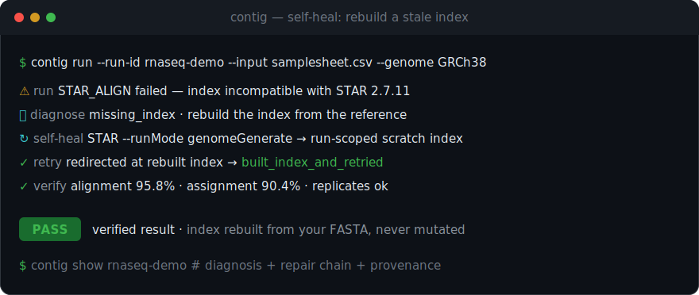
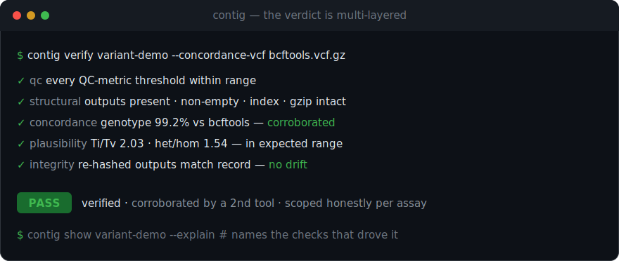
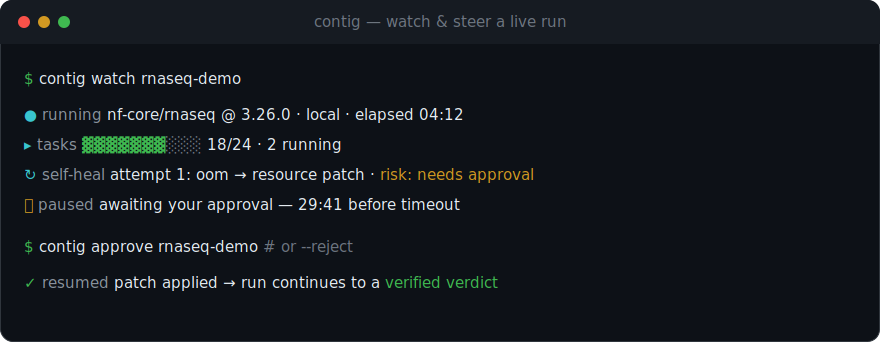
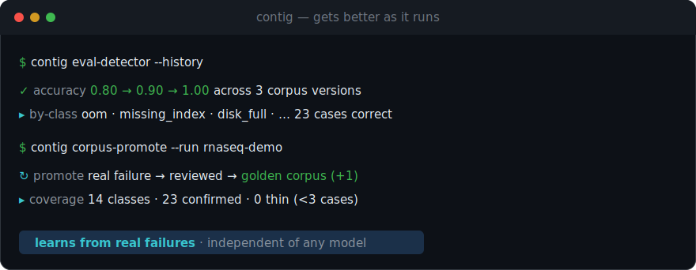

<div align="center">


# Contig

**An agentic bioinformatics analyst: it runs the analysis, fixes what breaks, and proves the result.**

Contig takes raw sequencing data all the way to a *verified, reproducible* answer: it selects and runs the right pipeline on your own compute, diagnoses and **self-heals** failures, **verifies** the output, and writes a portable record anyone can reproduce.

[](https://github.com/haqaliz/contig/releases/latest)
[](docs/ROADMAP.md)
[](LICENSE)
[](https://www.python.org/)
[](https://github.com/astral-sh/uv)
[](https://www.nextflow.io/)
[](CONTRIBUTING.md)

[Quickstart](#-quickstart) · [Usage](docs/USAGE.md) · [How it works](#-how-it-works) · [Architecture](docs/technical/ARCHITECTURE.md) · [Vision](VISION.md) · [Roadmap](docs/ROADMAP.md) · [Contributing](CONTRIBUTING.md)

<br/>


<sub>A real terminal capture (offline demo): a run that <b>OOMs</b> → <b>self-heals</b> → passes <b>QC</b> to a <b>PASS</b> verdict → a signed, <b>verified</b> record.</sub>

</div>

---

## Why Contig

Producing an end-to-end analysis from raw sequencing data needs a rare pairing of domain biology **and** computational engineering. Roughly **74% of wet-lab scientists have no programming experience** ([2507.20122](https://arxiv.org/html/2507.20122v1)), and frontier models still reach only **~17%** on real bioinformatics analysis ([BixBench, 2503.00096](https://arxiv.org/abs/2503.00096)). Turning English into a workflow is the easy, crowded part. **Running it, fixing it, and proving it is the unsolved part, and that's Contig.**

- 🧬 **Goal → pipeline, vetted.** Describe your goal in plain language; Contig proposes a curated pipeline + params to approve, and flags problems (no replicates, single-end, missing reference) *before* a multi-hour run.
- 🩹 **Self-healing runs.** When a step fails (OOM, a missing index it can build, version mismatch, malformed input), Contig diagnoses it, applies a safe patch, and retries, showing you the repair chain. A risky fix pauses the run for your approval instead of guessing.
- ✅ **Verified outputs.** Every run ends in an honest verdict (`PASS` / `WARN` / `FAIL` / `UNVERIFIED`) backed by real checks, never a bare "done", and `contig show --explain` names the exact checks that drove it. The verdict draws on several independent layers: QC-metric thresholds, structural and integrity checks on the output files, **cross-tool concordance** (a second independent tool corroborates a germline call set: `contig verify --concordance-vcf`), and **biological-plausibility** checks (assay-aware sanity such as the Ti/Tv and het/hom ratios for germline variants). Verification is scoped honestly per assay and never over-claims.
- 📦 **Reproducible by default.** Each run pins inputs (checksums), pipeline revision, params, and tool versions into a portable record. Reproduce any past run with one command or one click. Your reads never leave your machine; only hashes are recorded.
- 📈 **Gets better as it runs.** Every recovered failure becomes a labeled data point in a versioned failure corpus that compounds, independent of any single model, and a tracked accuracy trend shows the detector improving.
- 🖥 **Watch and steer, or run headless.** A local dashboard streams live task progress and the self-heal feed, and lets you approve patches, cancel, resume, and reproduce runs; the same controls are CLI commands for scripts and servers.
- ☁️ **Same run, laptop or cloud.** One command lands unchanged on Docker locally or AWS Batch in your own account, via Nextflow's native executors.

---

## 🎥 A closer look

Four things no incumbent does, each a real command on your own compute.

<div align="center">

**Self-heal a broken step** — diagnose the failure, patch it, retry, unattended.



**A verdict you can trust** — independent checks, honestly scoped per assay.



**Watch and steer, or run headless** — live progress and an approval gate for risky fixes.



**Gets better as it runs** — every failure compounds into a versioned corpus.



</div>

---

## 📦 Installation

Pick whichever fits your machine (each release ships all four):

```bash
# Python (any OS with Python 3.12+)
pipx install contig            # or: uvx contig --help

# Standalone binary (no Python needed): download from the latest release
#   https://github.com/haqaliz/contig/releases/latest
#   contig-linux-x86_64 | contig-macos-arm64 | contig-macos-x86_64 | contig-windows-x86_64.exe
chmod +x contig-macos-arm64 && ./contig-macos-arm64 --help

# Container (Docker Hub or GitHub Container Registry, same image)
docker run --rm haqaliz/contig:latest --help
docker run --rm ghcr.io/haqaliz/contig:latest --help

# Homebrew (macOS / Linux)
brew install haqaliz/contig/contig
```

From source, with [`uv`](https://github.com/astral-sh/uv):

```bash
git clone https://github.com/haqaliz/contig.git && cd contig
uv sync && uv run contig --help
```

Running a **real** pipeline also needs [Nextflow](https://www.nextflow.io/), a Java runtime (`JAVA_HOME`), and a running container runtime. The CLI and its self-contained commands (plan, show, verify, benchmark, eval-detector, ...) work without them. Full prerequisites are in [docs/USAGE.md](docs/USAGE.md#prerequisites), and the release process is in [RELEASING.md](RELEASING.md).

---

## 🚀 Quickstart

Try it in 30 seconds, no data of your own (uses nf-core/rnaseq's bundled test profile):

```bash
contig run --run-id smoke      # run → self-heal → verify → reproduce
contig show smoke              # verdict + provenance + repair chain
```

Run on **your** data: plan first, then run against a reference:

```bash
contig plan --goal "find differentially expressed genes" \
  --input samplesheet.csv --genome GRCh38      # propose a pipeline to approve

contig run  --run-id my-analysis \
  --input samplesheet.csv --genome GRCh38      # or: --fasta ref.fa --gtf genes.gtf
```

> Running from a source checkout instead of an install? Prefix each command with `uv run` (e.g. `uv run contig run --run-id smoke`).

Prefer a screen? The local dashboard launches runs and shows live progress, the self-heal feed, verdict explanations, and the detector trend:

```bash
cd dashboard && npm install && npm run dev      # http://localhost:3000 (localhost-only, no auth)
```

The full sample-sheet format, cloud backends, the reproducible bundle, the live controls, and the failure-corpus workflow are all in **[docs/USAGE.md](docs/USAGE.md)**.

---

## 🔍 How it works

Contig is built around **Layer 2** (the run-and-verify engine) and consumes Layer-1 workflow generation as a replaceable commodity.

```
  goal + data ──▶ plan ──▶ run ──▶ ⚠ failure? ──▶ self-heal ──▶ verify ──▶ verdict + record
                  (vet)   (your    diagnose →     (patch &      (QC        (PASS/WARN/
                          compute)  classify       retry)        checks)     FAIL/UNVERIFIED)
```

| Verdict | Meaning |
|---|---|
| `PASS` | Ran to completion and every QC check passed |
| `WARN` | Completed, but a QC check is borderline; look before you trust it |
| `FAIL` | A task or QC check failed; do not trust the output |
| `UNVERIFIED` | Completed, but nothing checked it, so we won't claim it's correct |

### Supported analyses

| Goal | Pipeline | QC checks | Maturity |
|---|---|---|---|
| RNA-seq differential expression | [`nf-core/rnaseq`](https://nf-co.re/rnaseq) | alignment/assignment rate, library-size skew, replicate checks | validated end-to-end |
| Single-cell RNA-seq | [`nf-core/scrnaseq`](https://nf-co.re/scrnaseq) | estimated cells, median genes per cell, reads in cells, mito fraction | wired · QC pack |
| Germline variant calling (research) | [`nf-core/sarek`](https://nf-co.re/sarek) | Ti/Tv & het/hom ratios, coverage | wired · QC pack |
| Somatic variant calling (tumor–normal, research) | [`nf-core/sarek`](https://nf-co.re/sarek) | Strelka2-vs-Mutect2 concordance, VAF distribution, panel-of-normals | wired · QC pack |
| Methylation (bisulfite) | [`nf-core/methylseq`](https://nf-co.re/methylseq) | bisulfite conversion rate, mapping efficiency, duplication | wired · QC pack |
| 16S amplicon (microbiome) | [`nf-core/ampliseq`](https://nf-co.re/ampliseq) | DADA2 read retention, ASV count, sample read depth | wired · QC pack |
| Shotgun metagenomics | [`nf-core/mag`](https://nf-co.re/mag) | assembly N50, bin completeness, contamination | wired · QC pack |

`contig plan` routes to the right one and **declines goals it has no curated pipeline for** rather than inventing a workflow. The same run → self-heal → verify → reproduce engine serves every assay above. **Maturity** is honest: `nf-core/rnaseq` is exercised end-to-end (including the self-heal loop) in CI; the others ship a curated pipeline + assay-aware QC pack and are being hardened toward the same end-to-end bar (see [docs/ROADMAP.md](docs/ROADMAP.md)).

---

## 📚 Documentation

| Document | What's in it |
|---|---|
| **[docs/USAGE.md](docs/USAGE.md)** | Full CLI reference, your-own-data walkthrough, the dashboard, live controls (watch, approve, cancel, resume), cloud backends, reproduce/share, failure corpus |
| **[CONTRIBUTING.md](CONTRIBUTING.md)** | Dev setup, package management (uv), tests, project layout, how to contribute |
| [VISION.md](VISION.md) | The narrative thesis, the moat, why now, non-goals |
| [docs/RESEARCH_FINDINGS.md](docs/RESEARCH_FINDINGS.md) | The validated evidence base behind the bet |
| [docs/ROADMAP.md](docs/ROADMAP.md) | Phased plan from validation to MVP and beyond |
| [docs/product/PRODUCT_SPEC.md](docs/product/PRODUCT_SPEC.md) | Product surface, flows, and behavior |
| [docs/technical/ARCHITECTURE.md](docs/technical/ARCHITECTURE.md) | The agentic execution/verification system design |
| [docs/business/](docs/business/) | Market analysis, business model, go-to-market |

> Some documents are placeholders being filled in during the validation phase.

---

## 🛠 Status & roadmap

**MVP engine built; in early access.** The Layer-2 core (run → capture → self-heal → verify → reproduce) works end-to-end on `nf-core/rnaseq`, built test-first, as a CLI and a local dashboard (launch, live progress, the self-heal approval gate, verdict explainability, one-click reproduce, and the detector-accuracy trend). Not yet built: an LLM-backed planner (the goal→pipeline matcher is deterministic and replaceable today), more assays, hosted multi-user access (the dashboard is localhost-only today), and live-tested `slurm`/`gcp_batch`/`k8s` backends (the mapping layer is in place; `local` and `aws_batch` are wired). See [docs/ROADMAP.md](docs/ROADMAP.md).

---

## 🤝 Contributing

Contributions are welcome: code, curated pipelines, QC checks, and especially **failure cases** for the corpus. Start with [CONTRIBUTING.md](CONTRIBUTING.md), then open an [issue](https://github.com/haqaliz/contig/issues) or a pull request.

## 📄 License

[Apache License 2.0](LICENSE) — permissive, with an explicit patent and trademark grant. Use, modify, and redistribute Contig, including commercially, under its terms. Contributions are accepted under the same license (see [CONTRIBUTING.md](CONTRIBUTING.md)). Contig orchestrates third-party pipelines (nf-core, Nextflow) that carry their own licenses; see [NOTICE](NOTICE).

<div align="center"><sub>Built test-first. The moat is execution, verification, and reproducibility, the part that gets <i>better</i> as models improve.</sub></div>
